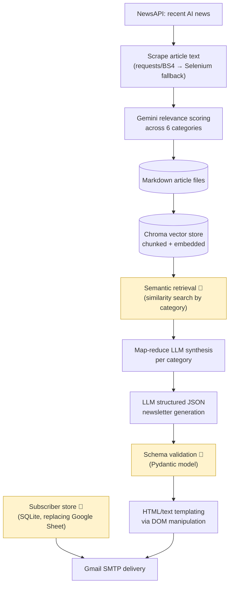

# AI Society Newsletter Pipeline
**Automated News-to-Newsletter Pipeline: Scraping, RAG, and LLM Synthesis at Weekly Cadence**

*Built for the AI Society at Terry at The University of Georgia* 🐶

---

## Introduction

### The Problem
Producing a weekly, multi-category newsletter by hand is a recurring, low-leverage editorial task. To keep members informed across six distinct interest areas — finance, tech, job market, stock market, management, and health care — someone would otherwise need to manually read dozens of AI-related news articles every week, judge which ones matter to which audience, and write up a coherent summary for each category. That doesn't scale with volunteer time, and it doesn't stay consistent week to week.

Any real solution needs to:
- **Pull in fresh, relevant news** from across the web every week without manual searching
- **Sort content into the right categories** reliably, even though relevance is often subjective
- **Synthesize long, varied source material** into short, readable summaries per category
- **Deliver a polished result** to a real subscriber list without manual formatting or sending

### The Solution
The **AI Society Newsletter Pipeline** automates the entire process end to end. Each week, it searches for recent AI-related news, pulls the full text of the most relevant articles, and scores each one for relevance across all six topic categories. Related content is organized into a searchable knowledge base, then synthesized into a clear write-up per category using an LLM. Those write-ups are dropped into a branded email template and sent automatically to the club's mailing list. What used to be a manual weekly writing task is now a single pipeline run.

---

## Architecture

### Diagram

🚧 = in progress

### Architecture Breakdown & Design Choices

| Layer | Choice | Why |
|---|---|---|
| **Article discovery** | NewsAPI `/v2/everything`, 7-day lookback | Simple, reliable source of recent AI-related articles without building a custom crawler |
| **Scraping** | Two-tier fallback: `requests` + BeautifulSoup first, headless Selenium second | A real resilience pattern — many news sites are JavaScript-rendered or actively resist simple scraping, so the pipeline falls back to a full headless browser only when the fast path fails |
| **Relevance filtering** | Gemini (`gemini-2.5-flash`) scores every article 0–10 across all six categories in a single call | Uses an LLM as a judgment layer in place of manual editorial triage — the same task a human curator would otherwise do by hand |
| **Vector store** | Chunked documents embedded with `gemini-embedding-001`, persisted in Chroma | Lays the groundwork for retrieval-augmented synthesis — content is chunked and embedded once, then available for semantic lookup rather than re-reading full articles on every run |
| **Synthesis** | Hierarchical map-reduce LLM summarization (chunk-level → pairwise reduction → final reduction) | Keeps every individual LLM call under context/token limits regardless of how long the source articles are — a genuine engineering solution to a real constraint, not a shortcut |
| **Newsletter generation** | LLM produces a structured JSON payload per category, spliced into HTML/text templates via DOM manipulation (BeautifulSoup) | Editing specific DOM nodes is more robust than naive string replacement — the template structure stays intact even if content length varies |
| **Delivery** | Gmail SMTP with STARTTLS | Lightweight and sufficient for the club's current subscriber volume, without standing up dedicated email infrastructure |
| **Secrets handling** | API keys and service-account credentials kept out of version control via `.gitignore` | Correct instinct from the start — credentials are never committed, even before other hygiene work is finished |

**Data flow:** NewsAPI query → scraped article text → LLM relevance scores → chunked + embedded documents in Chroma → category-specific retrieval → map-reduce synthesis → structured newsletter JSON → templated HTML/text → email delivery.

### Key Components & Quantitative Results

| Component | Status | Notes |
|---|---|---|
| NewsAPI ingestion | ✅ Implemented | Queries the last 7 days of AI-related articles |
| Two-tier scraping (requests/BS4 → Selenium fallback) | ✅ Implemented | Recovers content from JavaScript-rendered and scraping-resistant sites |
| LLM relevance scoring across 6 categories | ✅ Implemented | Single Gemini call scores each article against every category |
| Document chunking + embedding | ✅ Implemented | `RecursiveCharacterTextSplitter` + `gemini-embedding-001`, persisted in Chroma |
| Hierarchical map-reduce synthesis | ✅ Implemented | Chunk-level → pairwise → final reduction, keeps calls within context limits regardless of source length |
| Structured newsletter JSON generation | ✅ Implemented | LLM prompted for a specific JSON shape per category |
| HTML/text templating | ✅ Implemented | DOM-level edits via BeautifulSoup rather than string replacement |
| Email delivery via Gmail SMTP | ✅ Implemented | STARTTLS + App Password authentication |
| Secrets kept out of version control | ✅ Implemented | `.env`, service-account key, and vector store data all correctly gitignored |
| **Subscriber database** | 🚧 In progress | Migrating the mailing list from a shared spreadsheet to a proper database with send-history tracking |
| **Automated testing & CI** | 🚧 In progress | No test suite yet; adding coverage for core parsing/scoring logic plus CI is in progress |
| **Orchestration/scheduling** | 🚧 In progress | Pipeline is currently run manually; moving to a scheduled, automated trigger |
| **Async/concurrent processing** | 🚧 In progress | Scraping and per-article scoring currently run sequentially; concurrency work is planned to reduce runtime at higher article volumes |
| **Caching layer** | 🚧 In progress | Each run currently re-scrapes and re-embeds from scratch; content-hash-based caching for unchanged articles is planned |
| **Repository/dependency hygiene** | 🚧 In progress | Cleaning up git history and pinning dependency versions |

> **Note on metrics:** quantitative results (pipeline runtime, cache hit rate, relevance-scoring accuracy, delivery success rate) are actively being instrumented and will be added here once measured.
